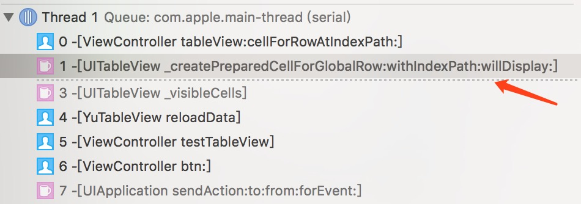
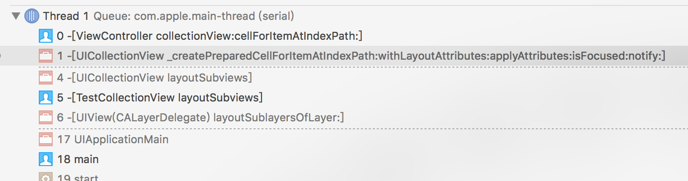

# TestVisibleCells
##   UITableView、UICollectionView之visibleCells方法的前世今生


### 前言：
对于[UITableView visibleCells]的正确获取，相信很多人，都会采用切换主队列的方式，来保证visibleCells数据的正确。究其原因，和RealoadData方法的异步性和RunLoop机制有关。

那么在当前以iOS8+环境下，切换主队列的方式，是否还生效呢？请大家随本文一起探究下去。

```
[self.tableView reloadData];
// 切换到主队列
dispatch_async(dispatch_get_main_queue(), ^{
NSArray *array = [self.tableView visibleCells];
NSLog(@"visibleCells====:%@",@(array.count));
});
```

## UITableView

### 首先确认ReloadData的异步性。执行测试代码：
```
- (void)testTableView {
[self.tableView reloadData];
NSLog(@"reloadData 执行完成");
}
```
监听reloadData执行前后，并同时监听RunLoop时机：
```
16:45:08 被唤醒
16:45:08 即将处理Timer事件
16:45:08 即将处理Source事件
16:45:08 -[ViewController btn:]
16:32:54 -[TestTableView reloadData] -----
16:45:08 -[ViewController numberOfSectionsInTableView:]
16:32:54 -[TestTableView setNeedsLayout] -----
16:32:54 -[TestTableView setNeedsLayout] =====
16:45:08 -[ViewController tableView:numberOfRowsInSection:]
16:32:54 -[TestTableView setNeedsLayout] -----
16:32:54 -[TestTableView setNeedsLayout] =====
16:32:54 -[TestTableView setNeedsLayout] -----
16:32:54 -[TestTableView setNeedsLayout] =====
16:32:54 -[TestTableView setNeedsLayout] -----
16:32:54 -[TestTableView setNeedsLayout] =====
16:32:54 -[TestTableView reloadData] =====
16:45:08 reloadData 执行完成
16:45:08 即将处理Timer事件
16:45:08 即将处理Source事件
16:45:08 即将休眠
16:32:54 -[TestTableView layoutSubviews] -----
16:45:08 -[ViewController tableView:cellForRowAtIndexPath:]=====
16:45:08 -[ViewController tableView:heightForRowAtIndexPath:]
16:45:08 -[ViewController tableView:heightForRowAtIndexPath:]
16:32:54 -[TestTableView layoutSubviews] =====
16:45:08 被唤醒
16:45:08 即将处理Timer事件
16:45:08 即将处理Source事件
16:45:08 即将休眠
```

分析日志:

reloadData 方法内部，执行了高度计算，但没有进行Cell的渲染工作。而是调用了setNeedsLayout，并将在下一个RunLoop处理时机，调用[UITableView layoutSubviews]方法对cell们进行渲染。

由此可见，reloadData方法执行完成后，cells 并没有被渲染，此时立即调用visibleCells方法会获取到数据的数据将是错误的。

但真实的情况呢？


### 测试visibleCells方法如下：

```
- (void)testTableView {

[self.tableView reloadData];
NSLog(@"reloadData 执行完成");

NSArray *array = [self.tableView visibleCells];
NSLog(@"visibleCells----:%@",@(array.count));

dispatch_async(dispatch_get_main_queue(), ^{
NSArray *array = [self.tableView visibleCells];
NSLog(@"visibleCells==== :%@",@(array.count));
});
}

```

同时监听runloop时机，日志如下：
```
13:00:32 即将处理Timer事件
13:00:32 即将处理Source事件
13:00:32 -[ViewController btn:]
13:00:32 -[TestTableView reloadData] -----
13:00:32 -[ViewController numberOfSectionsInTableView:]
13:00:32 -[ViewController tableView:numberOfRowsInSection:]
13:00:32 -[ViewController tableView:heightForRowAtIndexPath:]
13:00:32 -[ViewController tableView:heightForRowAtIndexPath:]
13:00:32 -[TestTableView reloadData] =====
13:00:32 reloadData 执行完成
13:00:32 -[ViewController tableView:cellForRowAtIndexPath:]
13:00:32 -[ViewController tableView:heightForRowAtIndexPath:]
13:00:32 -[ViewController tableView:cellForRowAtIndexPath:]
13:00:32 -[ViewController tableView:heightForRowAtIndexPath:]
13:00:32 visibleCells----:2
13:00:32 visibleCells====:2
13:00:32 即将处理Timer事件
13:00:32 即将处理Source事件
16:30:14 即将休眠
15:03:46 -[TestTableView layoutSubviews] -----
15:03:46 -[TestTableView layoutSubviews] =====
16:30:14 被唤醒
```

两次visibleCells方法都返回了正确的cells数据。这是为何？进一步查看visibleCells前后调用堆栈信息：



```
-[UITableView _createPreparedCellForGlobalRow:withIndexPath:willDisplay:]
```

分析上述日志：

原来如此，调用[UITableView visibleCells]方法时，会促使cell进行渲染。

### 小结


- reloadData 方法内部分为两部分：
- 计算了contenSize、contentOffset相关的内容。
- 设置当前TableView的子视图需要修改渲染和布局。这些任务将放在后续主队列中。
- 在下一次RunLoop时机，执行layoutSubviews方法。对TableView的子视图进行渲染和布局。
- visibleCells 方法内部，会执行createPreparedCell方法，使cell内容提前渲染。并在渲染过后，返回正确的Cells内容。

***因此，UITableView之visibleCells，如今(iOS8+)，可以直接调用，不需要再担心，数据不正确了！***


## UICollectionView

确认了[UITableView visibleCells]的机制之后，忍不住联想到UICollectionView是不是也这样呢。两者有很多的相似，同样继承自UIScrollView，类似的协议等等，那么直接调用visibleCells是不是也可以了？

```
Don't talk(bb),show you the code!
```

测试代码如下：
```
- (void)testCollectionView {

[self.collectionView reloadData];
NSLog(@"[self.collectionView reloadData];");

NSLog(@"visibleCells---%@",@([self.collectionView visibleCells].count));

dispatch_async(dispatch_get_main_queue(), ^{
NSLog(@"visibleCells===%@",@([self.collectionView visibleCells].count));
});
}
```

```
16:13:56 被唤醒
16:13:56 即将处理Timer事件
16:13:56 即将处理Source事件
16:13:56 -[ViewController btn:]
16:15:10 -[TestCollectionView reloadData] -----
16:15:10 -[TestCollectionView reloadData] =====
16:13:56 reloadData 执行完成
16:13:56 visibleCells---0
16:13:56 visibleCells===0
16:13:56 即将处理Timer事件
16:13:56 即将处理Source事件
16:13:56 即将休眠
16:15:10 -[TestCollectionView layoutSubviews] -----
16:15:10 layoutSubviews - visibleCells:3
16:15:10 -[TestCollectionView layoutSubviews] =====
16:13:56 被唤醒
```

#### 额，两次获取visibleCells数据都是0，两种方式都错了，这让人情何以堪！

注意到,下面代码中，visibleCells 数据获取正确了。
```
16:15:10 -[TestCollectionView layoutSubviews] -----
16:15:10 layoutSubviews - visibleCells:3
16:15:10 -[TestCollectionView layoutSubviews] =====
```

这是因为collectionView 和 tableView 在visibleCells内部有所不同。collectionView.visibleCells 方法执行时，没有立即触发layout相关事件。
因此，visibleCells 获取失败。需要在[TestCollectionView layoutSubviews]执行后才获取才能成功。

#### 进一步打印 cellforRow方法的调用栈如下



总归是和UITableView有了相似，创建Cell视图前，也执行前缀为createPreparedCell的方法
```
-[UICollectionView _createPreparedCellForItemAtIndexPath:withLayoutAttributes:applyAttributes:isFocused:notify:]
```

### 小结

也就是说，想要立即获取正确的visibleCells，需要主动触发layoutSubviews后，才进行获取。

- reloadData 方法内部分为两部分：
- 计算了contenSize、contentOffset相关的内容。
- 设置当前TableView的子视图需要修改渲染和布局。这些任务将放在后续主队列中。
- 在下一次RunLoop时机，执行layoutSubviews方法。对UICollectionView的子视图进行渲染和布局。
- visibleCells 方法内部，**不会执行createPreparedCell方法**，及无法确保cells被正确获取。
- 如果需要正确的获取visibleCells，则需要确保证获取时机在layoutSubView之后。
- 譬如，可以主动调用 [UICollectionView layoutIfNeeded]、[UICollectionView layouSubViews]等

## 总结

- [UITableView visibleCells]方法，内部机制，已经保证了获取数据的正确性。
- [UICollectionView visibleCells]方法，想要确保数据正确性，需确保layouSubViews事件被提前执行。

###  引申

如果，UICollectionView 作为一个Cell，被加载在UITableView上。此时获取visibleCells会是怎样的？请尝试回答以下代码中的问题。

```

[self.tableView reloadData];
NSArray *tableViewVisibleCells = [self.tableView visibleCells];
//  问题1：tableViewVisibleCells 是否正确？


for (UITableViewCell *cell in tableViewVisibleCells) {
// cell 上加载内容的视图，对应可能是CollectionView
UIView *view = cell.realContentView;
if ([view isKindOfClass:[UICollectionView class]]) {

UICollectionView *collectionView = (UICollectionView *)view;
NSArray *array = [collectionView visibleCells];
// 问题2：array 获取是否正确呢？
}
}
```

答案：

- 问题1：正确
- 问题2：正确

你答对了吗？

## 资料
- [测试代码](https://github.com/yu0winter/TestVisibleCells)
- [《深入理解RunLoop》——ibireme](https://blog.ibireme.com/2015/05/18/runloop/) 
- [《iOS 事件处理机制与图像渲染过程》——微信团队](https://mp.weixin.qq.com/s/qkZQnOuF_bn-mF44OdiKuA)


